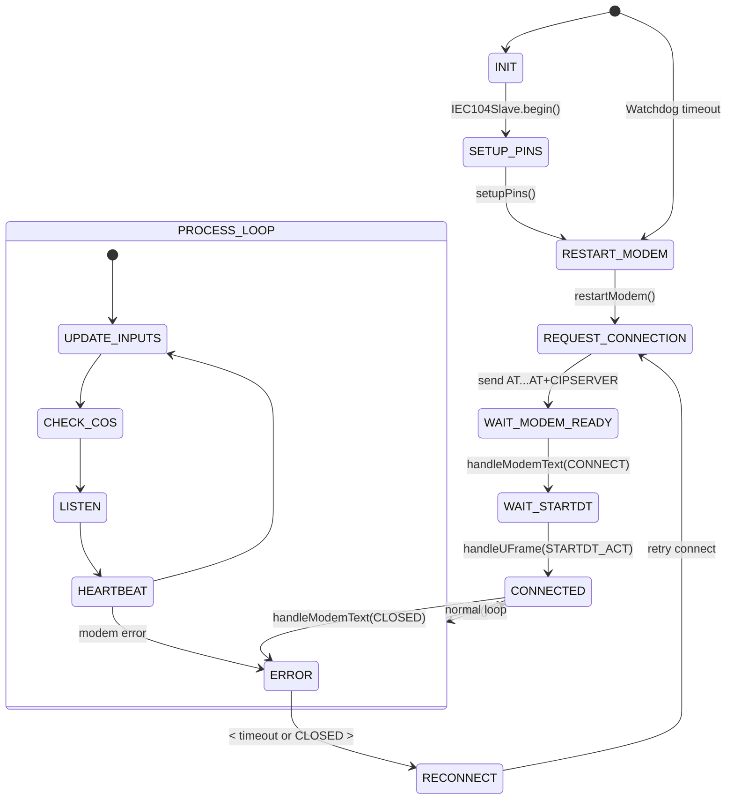

# 📡 IEC 60870-5-104 Arduino Slave FCO – v1.0

Proyek ini adalah implementasi protokol **IEC 60870-5-104** menggunakan **Arduino UNO** untuk keperluan komunikasi SCADA, khususnya sebagai **slave/server**.

## 📑 CHANGELOG RINGKAS

	•	✅ Handle hang
	•	✅ Penambahan fungsi watchdog
	•	✅ Opsi debug serial print

---

## 👤 AUTHOR & LICENSE

- **Author** : Mr. Pegagan  
- **Email**  : agungjulianperkasa@gmail.com  
- **License**: GNU Lesser General Public License v3.0

---

## 1. 🎯 TUJUAN PROGRAM

- Menjadi **slave/server IEC 104**
- Komunikasi TCP dengan **SCADA Master**
- Kirim status DI:
  - Remote/Local
  - GFD
  - CB (Open/Close)
- Eksekusi perintah DO: TI 46 (Open/Close)
- Timestamp CP56Time2a dari RTC DS3231
- Sinkronisasi waktu dari SCADA (TI 103)

---

## 2. 🧱 STRUKTUR FILE

| File             | Fungsi                           |
|------------------|----------------------------------|
| `goes.ino`       | Program utama (setup & loop)     |
| `IEC104Slave.h`  | Header class IEC104Slave         |
| `IEC104Slave.cpp`| Implementasi logika protokol     |
| `README.md`      | Dokumentasi versi                |

---

## 3. 🧩 FITUR UTAMA

| Fitur                                               | Status |
|-----------------------------------------------------|--------|
| STARTDT_ACT / TEST ACT response                     | ✅     |
| General Interrogation (TI 100)                      | ✅     |
| TI 30 – Remote, GFD status                          | ✅     |
| TI 31 – CB status (Double Point + Time)             | ✅     |
| COS – hanya kirim saat status berubah               | ✅     |
| CP56Time2a – encode dari RTC DS3231                 | ✅     |
| TI 46 – Double Command: OPEN/CLOSE                  | ✅     |
| Proteksi TI 46: Mode Remote & Status berbeda        | ✅     |
| ACK (COT=7) dan Termination (COT=10)                | ✅     |
| NS/NR sinkron dari master (Control Field)           | ✅     |
| Sinkronisasi RTC dari master (TI 103)               | ✅     |
| Penanganan reconnect TCP + kirim ulang status       | ✅     |
| Debug log: CP56Time2a, frame RX/TX, NS/NR           | ✅     |
| Modular class IEC104Slave                           | ✅     |

---

## 4. ⚙️ KONFIGURASI PIN

| Fungsi            | Arduino Pin |
|-------------------|-------------|
| Remote / Local    | D2          |
| GFD Status        | D3          |
| CB Status (Bit 1) | D4          |
| CB Status (Bit 2) | D5          |
| Relay CB OPEN     | D6 (PD6)    |
| Relay CB CLOSE    | D7 (PD7)    |

---

## 5. 📤 DATA YANG DIKIRIM

| TI   | IOA     | Keterangan              |
|------|---------|--------------------------|
| 30   | 1001    | Remote/Local (SP+Time)   |
| 30   | 1002    | GFD                      |
| 31   | 11000   | CB Status (DP+Time)      |
| 46   | 23000   | Double Command (Open/Close) |

---

## 6. 📥 FRAME YANG DIDUKUNG

| TI       | Fungsi                              |
|----------|--------------------------------------|
| 64       | General Interrogation (TI 100)       |
| 46       | Double Command (TI 46)               |
| 67       | RTC Sync (TI 103 – Clock Set)        |
| 1, 3     | Status DI (tanpa timestamp)          |
| 30, 31   | Status DI (dengan CP56Time2a)        |
| U-Format | STARTDT_ACT, TESTFR_ACT              |
| S-Format | Frame ACK / NS update                |

---

## 7. 🕒 FORMAT TIMESTAMP (CP56Time2a)

| Byte | Keterangan                  |
|------|-----------------------------|
| 0–1  | Millisecond (Little Endian) |
| 2    | Minute (6-bit)              |
| 3    | Hour (5-bit)                |
| 4    | Date (5-bit) + DayOfWeek    |
| 5    | Month (4-bit)               |
| 6    | Year (offset +2000)         |

---

 ## 8. 🔁 FLOW NS / NR
	•	rxSeq ← dari NS master (I-format)
	•	txSeq ← dari NR master (S-format)
	•	Sinkron otomatis
	•	Debug NS/NR jika aktifkan #define DEBUG

[CLOSED / CONNECT] → Deteksi modem
   ↓
[Menunggu STARTDT_ACT]
   ↓
← STARTDT_ACT → Kirim STARTDT_CON
   ↓
→ Kirim ulang status (TI 30, 31)

---

## Dokumentasi Flow & Finite State Machine GOES v2.0

Berikut dokumentasi alur eksekusi (flow) dan FSM (Finite State Machine) untuk project **GOES (Gardu Online Surveillance)** versi selanjutnya.

---

### 1. Overview Flow

1. **Boot & Inisialisasi**

   * Arduino start → `goes.ino` memanggil `IEC104Slave.begin()`
   * `begin()`:

     * Mulai RTC (DS3231)
     * Setup pin I/O
     * Reset & restart modem
     * Setup koneksi IEC 104 via AT commands
     * Inisialisasi awal variabel & state

2. **Loop Utama (`run()`)**

   * **Update Inputs**: baca status `Remote`, `GFD`, `CB`
   * **Check COS**: deteksi perubahan status DI → kirim frame TI 30/31
   * **Listen**: baca frame dari modem:

     * Teks AT response → `handleModemText()`
     * Frame IEC 104 → `handleIFrame()`, `handleSFrame()`, `handleUFrame()`
   * **Check COS (lagi)**: untuk cover edge-case setelah listen
   * **Heartbeat & LED**: tangani LED status, watchdog reset

3. **Error Handling & Recovery**

   * **Watchdog Timer**: reset board jika hang
   * **Timeout koneksi**: auto reconnect jika tidak ada activity selama X detik
   * **Modem CLOSED**: deteksi di `handleModemText()` → pindah ke state reconnect

---

### 2. FSM (Finite State Machine)

State machine berikut menggambarkan berbagai kondisi koneksi & operasi GOES:

**Penjelasan State:**

* **INIT**: Inisialisasi variabel & objek
* **SETUP\_PINS**: Konfigurasi pin digital
* **RESTART\_MODEM**: Power-cycle modem
* **REQUEST\_CONNECTION**: Kirim AT commands untuk setup TCP server
* **WAIT\_MODEM\_READY**: Tunggu "CONNECT" dari modem
* **WAIT\_STARTDT**: Tunggu perintah STARTDT\_ACT dari SCADA Master
* **CONNECTED**: Siap operasikan IEC 104 (masuk loop utama)
* **PROCESS\_LOOP**: Sub-state machine di dalam loop
* **ERROR**: Terjadi error koneksi / hang
* **RECONNECT**: Coba ulang proses koneksi

---

### 3. Catatan Implementasi

* **Watchdog**: panggil `wdt_enable(WDTO_8S)` di `INIT`
* **Timeout koneksi**: gunakan `millis()` untuk deteksi inactivity
* **LED Indikator**: tampilkan state `CONNECTED` vs `ERROR`
* **Modularisasi**: pisahkan tiap state handling ke metode sendiri
